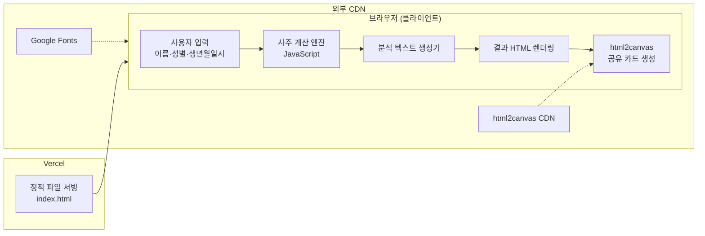
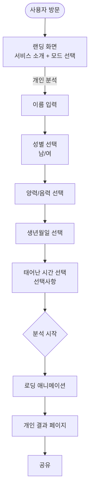
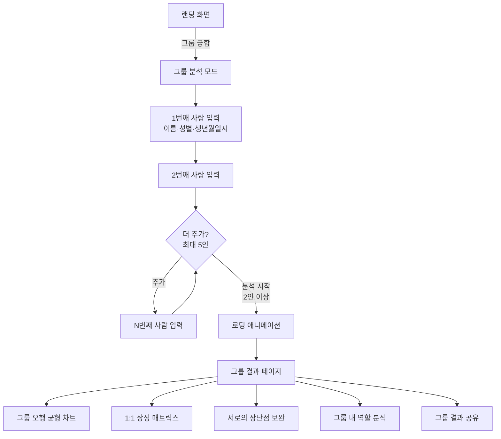
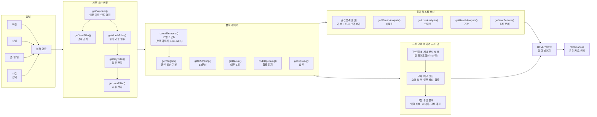

# 기술 스택 및 시스템 구조 — SAJU (What's Your Saju)

---

## 1. 기술 스택

### 현재 스택

| 영역 | 기술 | 선택 이유 |
|------|------|-----------|
| **언어** | JavaScript (Vanilla) | 프레임워크 없이 브라우저 네이티브 실행, 의존성 0, 오프라인 동작 가능 |
| **마크업/스타일** | HTML5 + CSS3 (인라인) | 단일 파일 배포의 극단적 단순성, CDN·빌드 도구 불필요 |
| **폰트** | Google Fonts (Noto Serif KR, Cormorant Garamond, Nanum Myeongjo) | 동양적 서체 + 서양 세리프 조합으로 신비로운 브랜드 톤 형성 |
| **이미지 생성** | html2canvas (CDN) | DOM → Canvas → PNG 변환, 서버 없이 클라이언트에서 공유 카드 생성 |
| **배포** | Vercel (정적 호스팅) | 무료 티어, 전역 CDN, Git 연동 자동 배포, HTTPS 자동 적용 |
| **도메인** | whatsyoursaju.vercel.app | Vercel 기본 서브도메인 (커스텀 도메인 연결 가능) |

### 의도적으로 사용하지 않는 것

| 미사용 기술 | 이유 |
|-------------|------|
| React/Vue/Svelte | 프레임워크 오버헤드 불필요, 단일 페이지 분석 도구에는 바닐라 JS로 충분 |
| Node.js 서버 | 모든 계산이 클라이언트에서 완료, 서버 사이드 로직 없음 |
| 데이터베이스 | 사용자 데이터를 저장하지 않음, 분석은 매번 실시간 계산 |
| 번들러 (Webpack/Vite) | 단일 HTML 파일이므로 번들링 불필요 |
| TypeScript | 현재 규모에서는 타입 안전성보다 개발 속도 우선 |
| 테스트 프레임워크 | Node.js 직접 실행으로 충분, Jest/Mocha 등의 도입 오버헤드 불필요 |

### 단계적 확장 로드맵

```
[현재] 단일 HTML + Vanilla JS + Vercel
   │
   ├─ Phase 2: 파일 분리
   │   index.html → HTML 구조만
   │   saju-engine.js → 계산 엔진 (순수 함수)
   │   saju-text.js → 풀이 텍스트 데이터
   │   saju-ui.js → UI 로직
   │   style.css → 스타일시트
   │
   ├─ Phase 3: 빌드 도구 도입 (필요 시)
   │   Vite → 코드 스플리팅, 트리 셰이킹
   │   ES Modules → import/export 구조
   │
   └─ Phase 4: 서버 추가 (필요 시)
       Supabase/Firebase → 사용자 이력 저장
       Edge Functions → LLM API 프록시 (AI 상담 기능)
```

---

## 2. 시스템 구조

### 전체 아키텍처



### 핵심 포인트

- **서버가 없다**: 모든 계산, 분석, 렌더링이 사용자의 브라우저에서 실행
- **네트워크 요청 = 0**: 페이지 로드 후 분석 과정에서 추가 네트워크 요청 없음
- **외부 의존성 = 2개**: Google Fonts (폰트), html2canvas (공유 카드)
- **오프라인 가능**: 한 번 로드되면 오프라인에서도 분석 가능 (폰트 캐시 시)

---

## 3. 유저 흐름 구조

### 개인 분석 플로우



### 그룹 궁합 플로우



### 각 단계의 사용자 경험 목표

| 단계 | 사용자가 느껴야 하는 것 | 구현 방식 |
|------|------------------------|-----------|
| **랜딩** | "오, 뭔가 신비롭고 고급스러워 보인다" | 우주 배경 파티클, 금색 타이틀, 서체 |
| **입력** | "간단하네, 이것만 넣으면 되는구나" | 최소 입력 (이름+성별+생년월일), 드롭다운 |
| **로딩** | "뭔가 진지하게 계산하고 있구나" | 팔괘 회전 애니메이션, "명리 해석 중..." |
| **결과 상단** | "와, 한자로 된 내 사주가 뭔가 있어 보인다" | 4주 카드 (한자 크게, 오행 색상) |
| **결과 스크롤** | "성격 분석이 꽤 맞는 것 같은데..." | 일간별 × 신강/신약 분기, 구체적 일상 예시 |
| **공유** | "이거 친구한테도 보여줘야지" | 1탭 이미지 저장, URL 복사 |

---

## 4. 데이터 흐름 구조

### 분석 파이프라인



### 데이터 구조

| 데이터 | 형태 | 예시 |
|--------|------|------|
| 기둥 (Pillar) | `{ gan: number, ji: number }` | `{ gan: 0, ji: 10 }` → 甲戌 |
| 절기경계 | `[양력월, 시작일, 지지인덱스][]` | `[10, 8, 10]` → 한로(10/8)부터 戌月 |
| 오행카운트 | `{ 목: n, 화: n, 토: n, 금: n, 수: n }` | 천간+지지+장간 합산 |
| 대운 | `{ gan, ji, age }[]` | 8개, 10년 단위 |
| 풀이 텍스트 | HTML 문자열 | 하이라이트·경고 span 포함 |

### 데이터 흐름의 특징

1. **완전 동기 처리**: 모든 계산이 동기 함수, 비동기/Promise 없음
2. **상태 없음 (Stateless)**: 분석 결과를 어디에도 저장하지 않음. 매번 처음부터 계산
3. **단방향 흐름**: 입력 → 계산 → 분석 → 텍스트 → 렌더링. 역방향 데이터 흐름 없음
4. **setTimeout 2초**: 유일한 비동기 — 로딩 애니메이션용 인위적 딜레이

### 그룹 궁합 시 데이터 흐름 (신규)

그룹 궁합은 개인 분석 파이프라인을 **N번 실행**한 뒤 교차 비교를 수행:

```
[N명의 입력] → [각 1인씩 개별 분석 (기존 파이프라인 재사용)]
    → [N명의 분석 결과 배열]
    → [교차 비교 엔진]
        ├─ 오행 보완: A에게 부족한 오행을 B가 채워주는가?
        ├─ 일간 상성: 天干 간 생극(生剋) 관계
        ├─ 합충 교차: A의 지지와 B의 지지 간 육합/상충
        └─ 용신 매칭: A의 용신이 B의 강한 오행인가?
    → [그룹 종합]
        ├─ 전체 오행 분포 (합산)
        ├─ 그룹 내 역할 (리더/조율자/실행자/분석가/케어)
        └─ 장단점 상호 보완 매트릭스
    → [그룹 결과 렌더링]
```

### 장간 가중치 시스템 (핵심 도메인 로직)

오행 카운트 시 지지 안에 숨어 있는 천간(장간)에 가중치를 부여:

| 위치 | 가중치 | 의미 |
|------|--------|------|
| 본기 (1번째) | 0.7 | 해당 지지의 주된 기운 |
| 중기 (2번째) | 0.3 | 보조적 기운 |
| 여기 (3번째) | 0.1 | 미약한 잔여 기운 |

예시: 戌(술) → 장간 `['戊', '辛', '丁']`
- 戊(토) × 0.7, 辛(금) × 0.3, 丁(화) × 0.1

---

## 5. 현재 구조의 강점과 한계

### 강점

| 강점 | 효과 |
|------|------|
| 서버 비용 0원 | 트래픽이 아무리 증가해도 Vercel 무료 티어로 충당 |
| 배포 즉시 반영 | Git push → 자동 배포, 별도 CI/CD 불필요 |
| 오프라인 동작 | 페이지 로드 후 네트워크 없이도 분석 가능 |
| 빌드 타임 0 | HTML 파일 하나를 그대로 서빙 |
| 개인정보 이슈 0 | 사용자 데이터가 서버로 전송되지 않음 |

### 한계 및 개선 방향

| 한계 | 현재 상태 | 개선 방향 |
|------|-----------|-----------|
| 단일 파일 2,260줄 | 유지보수 어려움 | JS 모듈 분리 (엔진/텍스트/UI) |
| 테스트 코드 중복 | test_step1~3에 계산 함수 복사본 | 공통 엔진 모듈에서 import |
| 절기 정밀도 | 평균값 기준 ±1일 오차 | 연도별 실제 절기 데이터 테이블 |
| 음력 미지원 | 경고 후 차단 | 음양력 변환 라이브러리 도입 |
| SEO 한계 | 결과 페이지 동적 생성 | 정적 결과는 현재도 문제없음 |
| 분석 데이터 비검증 | 풀이 텍스트의 명리학적 정확성 미검증 | 전문가 검수 또는 커뮤니티 피드백 |
